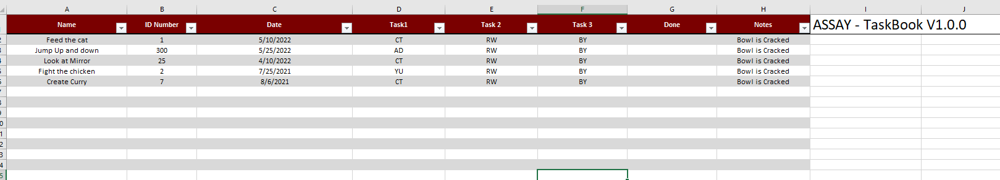
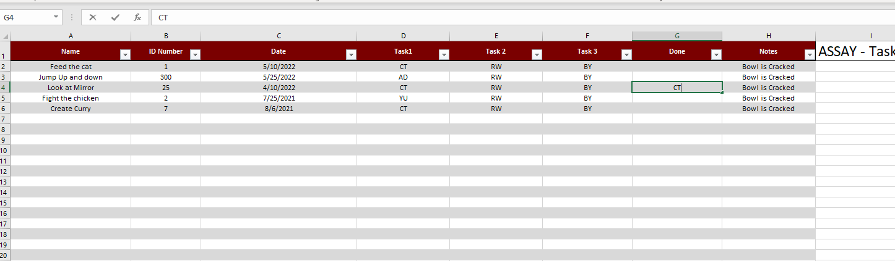
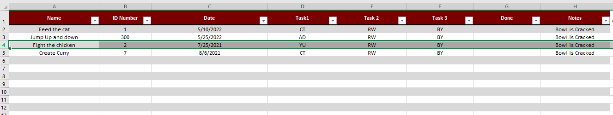
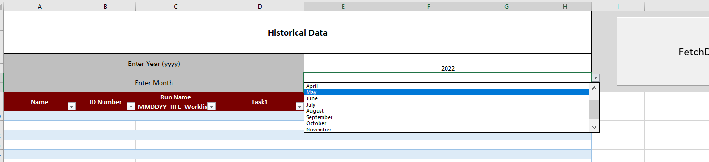
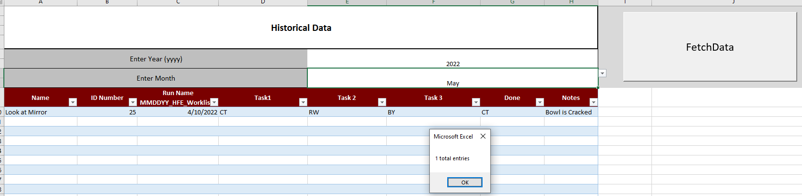

# Introduction

This is a generic task book that comes with the ability to auto clear a task out of the task book and auto serialize the data. The task book comes with a very simplistic and straight forward design. The Table inside of the task book can be altered with additional columns without breaking the functionality of the task book. As long as the word “Done” is located in the top column, the task book will function normally.

This was made as a project for work with the request of having a simplistic front end with a powerful backend that could be data mined if needed. The task book provide a simple left to right workflow with a trigger. If a user adds characters to the done column, that entire row will be serialized and stored in a text file and can later be parsed in the historic data tabs. The historic data is sorted into year and month.

# Usage

Entry of Data is the same as you would do in excel.

When finished, fill in the done section with any value (employee id, initials, etc.) and the task book will remove the item and move any existing items up.

Entry was removed for task book.

The data was serialized to a records file located in the same directory as the excel file.

Entries will be parsed into the historic data and visualized.

Data is serialized with the delimiter of “\|\|”. If ‘\|’ is used in values, this could possibly alter the data when being parsed.

# Updates

-   1/12/22
    -   Created Task book
-   2/24/22
    -   Create a timing code that will auto close the task book if left open.
    -   Change file type to binary excel sheet to reduce size.
    -   Change the editable area to ensure size and workbook size stays constant.
-   5/10/22
    -   Create global variable to aid in creation of folder name and searching for data.
    -   Add if statement to prevent the done column from triggering function that serialize and deletes row.
